---

<!-- truncate -->

**ChatGPT** 持续火爆，相信大家都听说过他的大名。因为不仅功能十分强大，关键账号还是永久免费使用。但是ChatGPT不支持国内网络和国内用户，很多新手小白朋友还是不清楚 **ChatGPT** 是什么，怎么才能拥有账号，本文将手把手告诉大家，**ChatGPT** 是什么和怎么用怎么注册账号。

想要购买  ChatGPT 已注册好成品号的朋友，可以直接 [点此链接到某宝购买ChatGPT成品号](https://chatgptzhanghao.com/buy-chatgpt-zhanghao-link/)，马上提升工作效率！永久免费使用的官方正版账号。

## ChatGPT 是什么

**ChatGPT** 是由 OpenAI 开发的一种大型语言模型，可以用于回答各种问题、生成文本、进行对话等自然语言处理任务。

简单来说，Chat GPT就是最新一代通用型超强 AI，拥有庞大的知识库，能够回答各种各样的问题。有什么问题，问ChatGPT就行了！

ChatGPT 由 OpenAI 在2022年11月30号发布，发布5天后全球用户数就超过了100w。

## ChatGPT 官网

**ChatGPT**的官方网址是 [https://chat.openai.com](https://chat.openai.com/)

请认准其官方域名 [openai.com](https://openai.com/)，不是这个域名的ChatGPT服务都是镜像站或者假冒伪劣网站，请注意辨别。（国内山寨版本很多）

## 如何注册 ChatGPT 使用流程

这么强大的工具我们都想体验一下，那么 **ChatGPT** 怎么用呢？接下来将给你逐步详细介绍。

使用 ChatGPT 主要有4步：

1. 注册 ChatGPT 账号
2. 注册需要一个外国手机号码：通过短信接码平台 [sms-activate.org](https://sms-activate.org/?ref=2780512) 完成 ChatGPT 手机号验证
3. 登录 ChatGPT 账号，对话框输入，开始使用 Chat GPT ！
4. 输入任意问题，探索 ChatGPT 的强大功能

好了，我们开始逐步图文介绍。

由于 OpenAI 官方限制了中国大陆地区用户使用，所以中国手机号码无法验证，需要外国手机号，这导致注册 Chat GPT 的过程会略微复杂。对于怕麻烦的朋友来说最简单直接的办法就是到淘宝买一个已经注册验证好的号，自动发货，即买即用，已经搞定外国手机号验证，不用准备各种复杂的环境（适合新手小白）。非常推荐！[点此到某宝购买ChatGPT成品号](https://chatgptzhanghao.com/buy-chatgpt-zhanghao-link/)

下面是具体过程。

## 1.注册 ChatGPT 账号

注冊ChatGPT这一步主要包含以下几步（需要按照顺序逐步操作）：

1. 将网络环境切换成国外ip（注意：必须是国外 ip 如美国、加拿大，日本，新加坡等openai支持的国家，香港澳门 ip 是不行的），且后续整个注册流程都必须在此网络环境下进行。
2. 打开官方注册 [https://chat.openai.com/auth/login](https://chat.openai.com/auth/login) 链接并使用自己的邮箱进行账号注册（必须要国外邮箱）
3. 打开邮箱查收 OpenAI 账号验证邮件，点击验证按钮完成邮箱验证

下面每一个步骤的图片，大家可以对照着进行操作

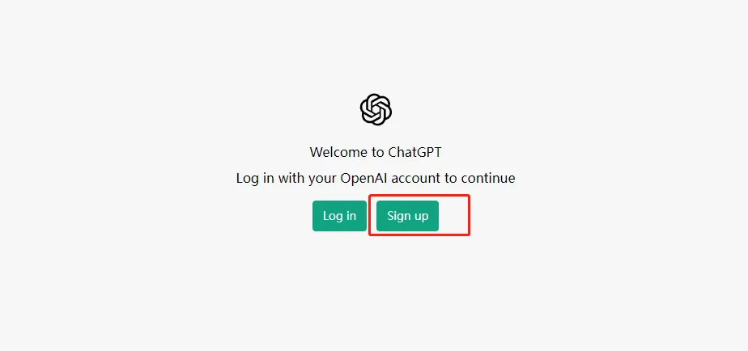

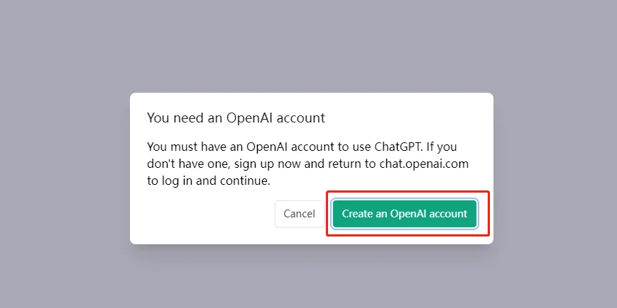

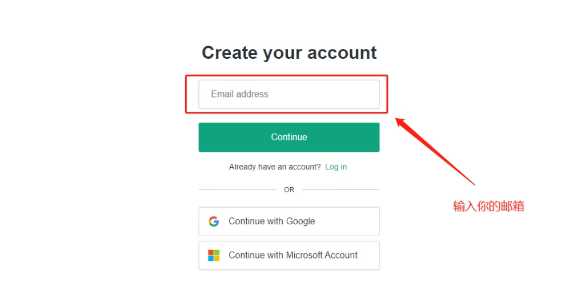

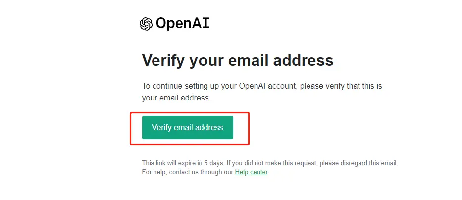

邮箱验证完成后，我们第一步注册 [ChatGPT 账号](https://chatgptzhanghao.com/)就算完成了，但是到这里我们还不能开始使用 ChatGPT，因为我们还需要进行外国手机号码验证。没有通过手机号码验证是使用不了 OpenAI（ChatGPT的开发商） 的服务的。

因为OpenAI官方的限制，国内和港澳的手机号码还有 Google Voice 的虚拟号码都是不能使用的。

这时候就要用到下一步的接码平台。

现在接码的成本大约在 1 美金以上，（之所以说以上，即如果你能一次验证成功，成本大约就是1美金，但是如果失败，就1美金往上）不过随着现在注册难度增大，有可能会接码失败，失败了就重新再来。需要再重新购买号码。如果你害怕一直验证失败，怕麻烦，可以直接移步某宝直接 [点此购买现成账号](https://chatgptzhanghao.com/buy-chatgpt-zhanghao-link/) 也是一种划算的选择，直接购买即可，是已经注册好的成品账号直接官网登录使用，不需要再进行麻烦的国外手机验证过程。

那要怎么验证呢，请看下一步。

## 2.完成 ChatGTP 手机号码验证

这一步需要用到接码平台完成手机号验证，推荐平台链接地址：[sms-activate.org](https://sms-activate.org/?ref=2780512)

具体过程包含以下几步：

1. 通过自己的邮箱注册 sms-activate.org 账号并完成邮箱验证（其他接码平台同理，但是不一定每个都好用，sms-activate是博主亲自验证过的）
2. 打开邮箱查收验证邮件并点击确认完成 sms-activate.org 账号认证
3. 登录sms-activate并且在右上角找到充值按钮，点击进行充值
4. 点击充值跳转后，往下滑找到支付宝，这里建议大家充值1美金就可以了（不够用再充）。
5. 充值好了以后回到首页搜索「open」关键字就可以找到 OpenAI 验证码的临时号码购买链接。
6. 在右侧激活区看到待使用的临时号码，将此号码复制到 OpenAI 的验证码接收区里面。
7. 在 OpenAI 的页面点击发送验证码，这样就可以在接码平台接收到验证码（有时候有一点慢需要耐心等待一下），将验证码填进去，这样就完成 ChatGPT 手机号验证了。

这一步比较长，但是操起其实也不复杂，简单说就是通过接码平台收验证码完成验证。（ps：6月份以后注册难度增加，就是可能会失败，比如号码失效，标记你的邮箱无法注册等）

如果嫌麻烦的朋友可以直接移步某宝购买一个现成已经注册好的账号，可以改密码，私人账户，效果是一样的。

【某宝】[https://item.taobao.com/item.htm?ft=t&amp;id=722036476962](https://chatgptzhanghao.com/buy-chatgpt-zhanghao-link/) 这个就是 ChatGPT账号
点击链接直接打开

下面是每一步的操作图，大家可以对照操作。

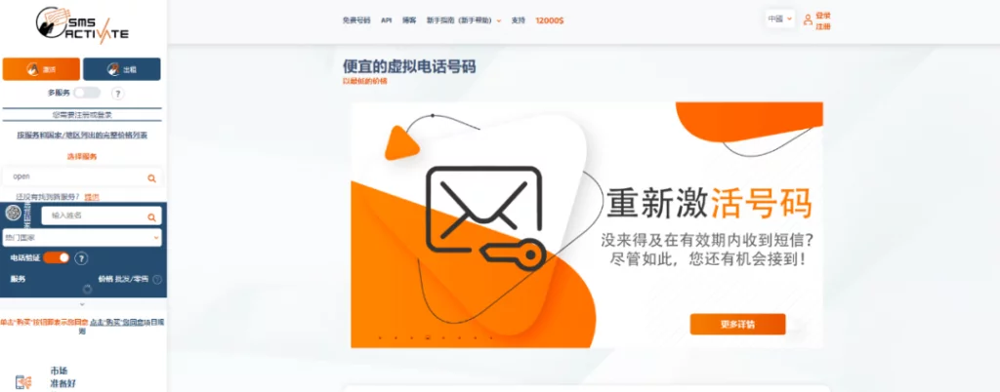

打开邮箱找到验证邮件

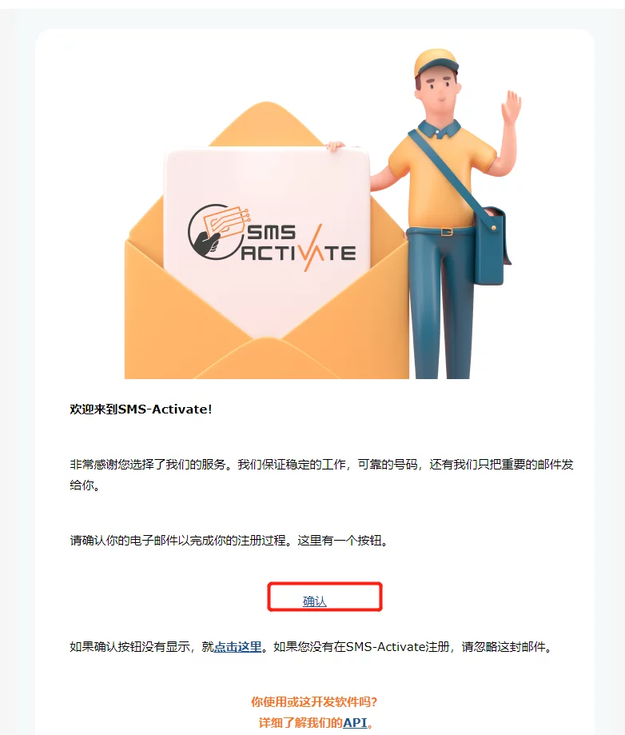

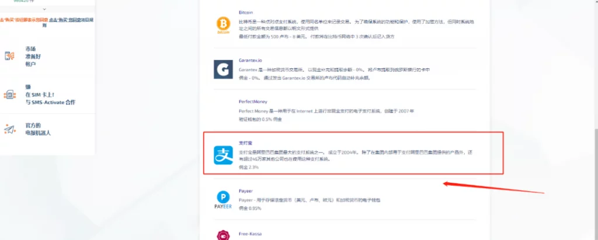

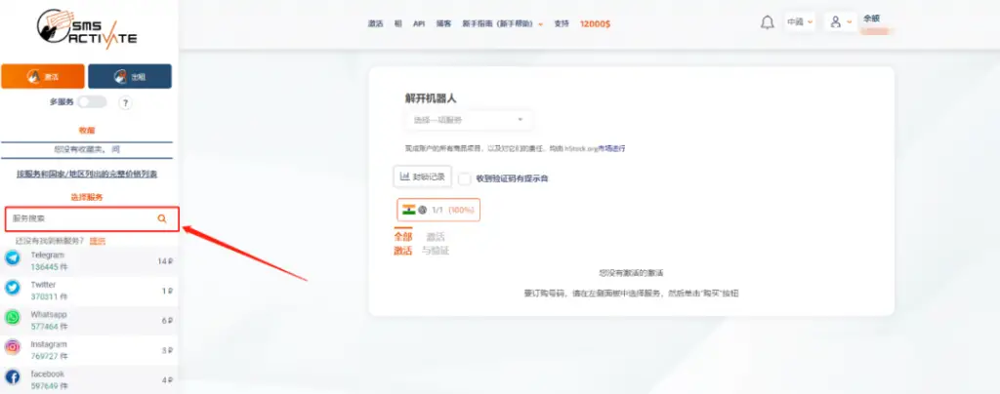

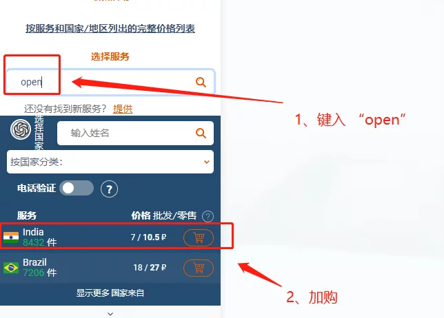

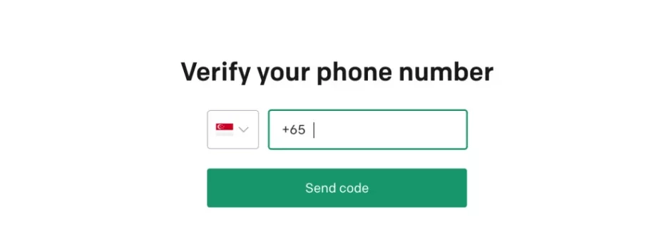

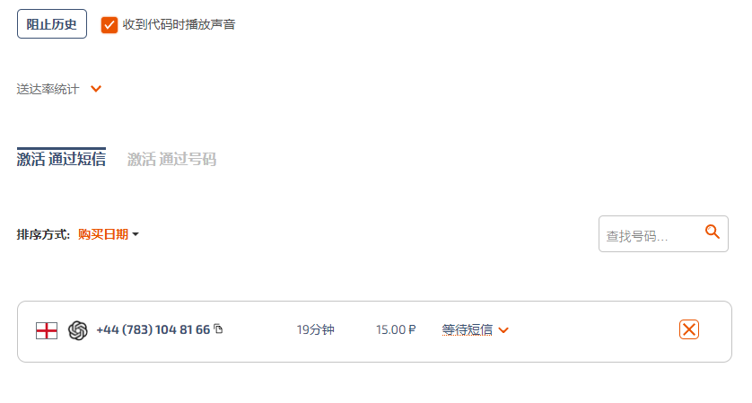

历经千辛万苦，我们终于可以开始使用 ChatGPT 啦，恭喜！

## 3.登录 ChatGPT 账号并开始使用

注册成功后，或者你直接点击[淘宝购买现成账号](https://chatgptzhanghao.com/buy-chatgpt-zhanghao-link/)，有了官方账号，我们就可以直接去 ChatGPT 网站去登陆使用： [https://chat.openai.com/auth/login](https://chat.openai.com/auth/login)

输入账号密码就可以成功登录。

登录以后我们会进入到 ChatGPT 的主界面，在屏幕的正下方就是我们使用 ChatGPT 的输入对话框，ChatGPT采用交互式对话界面，使用非常便捷友好，你可以任意输入你感兴趣的内容并敲回车，ChatGPT 将会回答你。

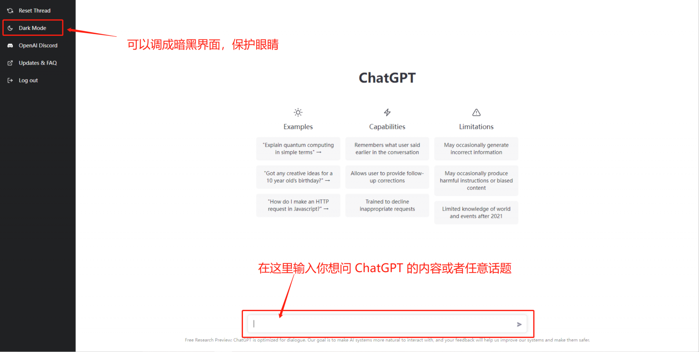

比如我们问一下 ChatGPT 梯形相关的问题，看看他会怎么回答。

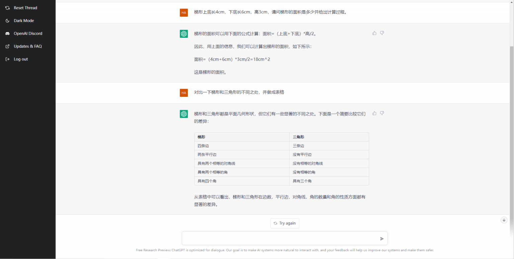

到这里，你已经学会了如何使用 ChatGPT 了！

## 4.探索 Chat GPT 的强大功能

你可以尝试用各种方式向 ChatGPT 提出各种各样的问题或者指令，通过这一步你将更能体会到 ChatGPT 的强大之处。来吧，朋友，让我们真正学会 Chat GPT 怎么用。

比如：

* 叫 ChatGPT 写一首诗
* 叫 ChatGPT 写代码
* 叫 ChatGPT进行翻译
* 叫 ChatGPT 编故事

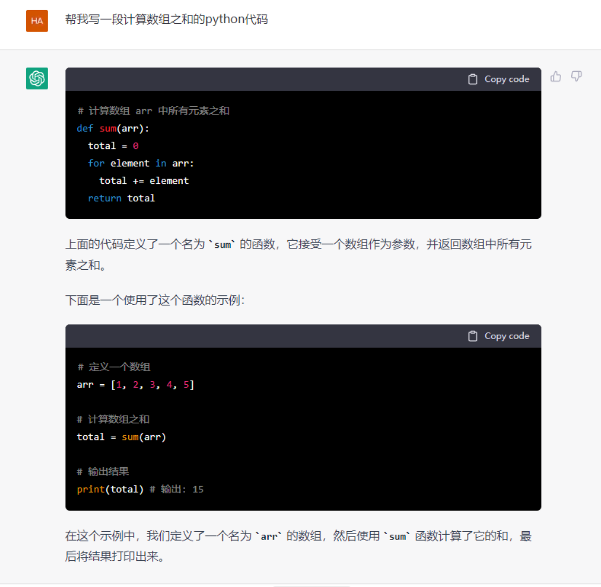

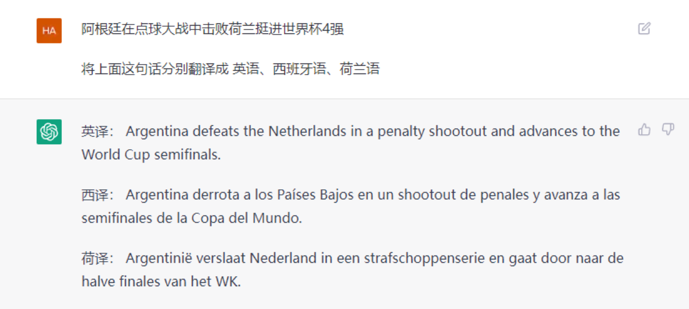

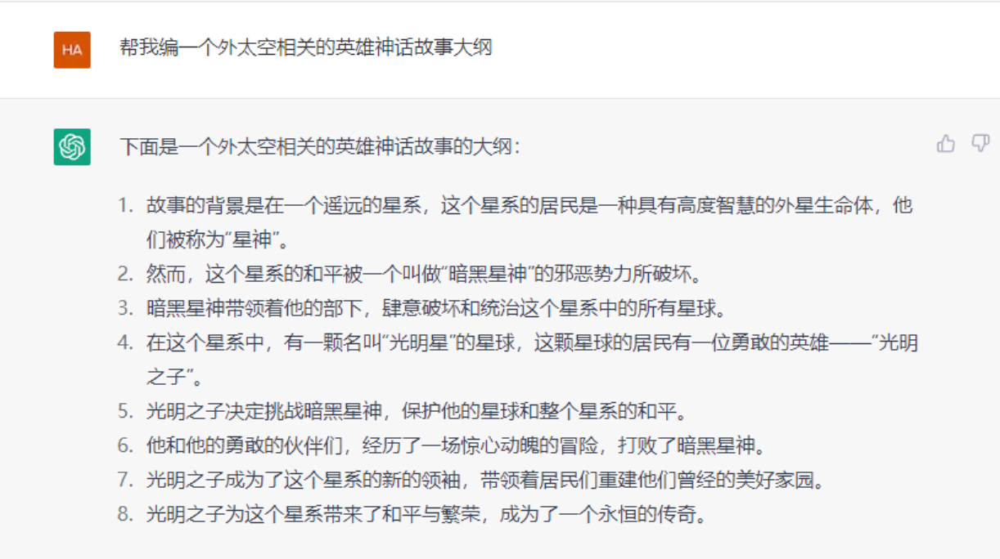

好啦，到这里为止，我们已经一步步教会了你怎麽注冊 ChatGPT账号，怎么通过 ChatGPT 手机号验证，怎么用 ChatGPT。

祝大家玩的愉快！

如果看到这里还是觉得 ChatGPT 账号注册过于麻烦的朋友，可以直接到某宝购买哦， [点此购买ChatGPT现成账号](https://chatgptzhanghao.com/buy-chatgpt-zhanghao-link/) 打开看到 “皮特的号” 就是ChatGPT账号。

这更适合不懂技术或不想折腾但是又想马上尽快体验到 ChatGPT 的朋友，而且账号可靠，售后保证，有什么不懂随时可以咨询，用起来也很省心。

---
