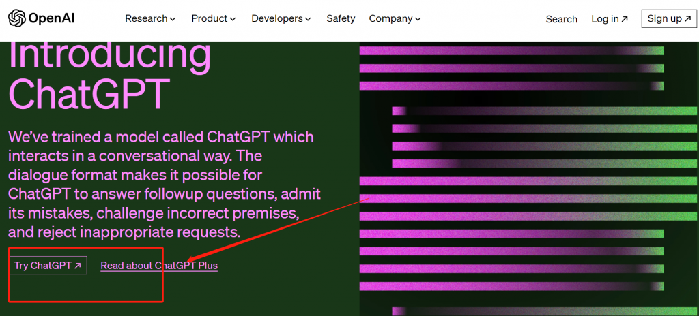
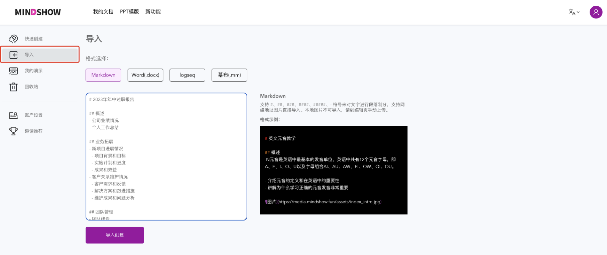
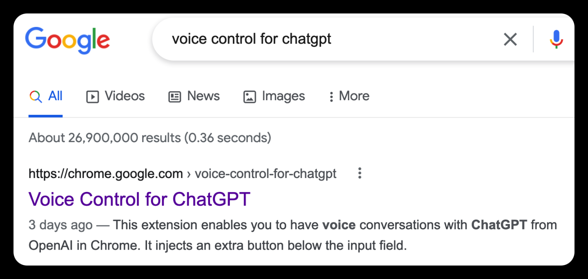

---

<!-- truncate -->

ChatGPT登录流程以及超级干货的使用攻略！！手滑到这里不要动，接下来的十几分钟 **可能是你人生中最重要的顿悟时刻** ！！全文爆肝 1W 字，一篇文章带你系统掌握 ChatGPT以及相关 AI 的用法， **本文无废话，全程高能，全部都是实操** ，纯小白也能看懂，用起来。前提是你需要有ChatGPT官方账号，如果你没有，可以看[ChatGPT账号注册指南](https://chatgptzhanghao.com/)或者简单直接点击[淘宝购买一个永久使用的ChatGPT私人账号](https://chatgptzhanghao.com/buy-chatgpt-zhanghao-link/)

只要你能认真读完本文，我保证**能让你对 AI 的应用能力，超越 90% 的人！！！不要被割韭菜，本文技巧全部免费赠送，不要去乱买那些好几百的课！！**

---

## **登录ChatGPT官网教程**

设置好全局Global外国科学上网，（香港，俄罗斯，越南等节点不行）

 **登陆ChatGPT详细步骤** ：

进入官方网址：

[https://openai.com/blog/chatgpt/](https://openai.com/blog/chatgpt/)

点击左边的 Log in， Log in 是直接登录， 不要点右边的Sign up！！

**直接输入购买的已经注册好的官方账号** ，点continue 继续，然后输入密码，点continue 继续，就登上去了，就是这么简单。如果你登录不上，（比如你进去的页面是空白，显示unable to load site等,你就换你的VPN代理线路，换到一个可以登上的，原因就是chatgpt会封ip，如果ip被检测到，就换一个）

如果你的VPN代理线路正常，这样就登录上去了，接下来正文开始。如果你登不上，请点击看这篇[ChatGPT登不上问题解决办法](https://chatgptzhanghao.com/how-to-use-chatgpt/)，一般是通过换代理线路解决。

## 如何得到高质量的ChatGPT回答

ChatGPT的回答质量取决于你的提问，也就是这把AI屠龙刀取决于你怎么用。

很多同学拿到 GPT 后的 **第一个痛点就是：用的不好** 。

也就是说，你经常会感觉到 ChatGPT 回答的好空，没有太多参考价值……

而**第二个痛点则是：无处去用。**

也就是说：有了 GPT 之后，发现自己好像并没有什么好问的，不知道可以用 GPT 来干嘛。

所以，在这两个痛点的影响下，当你折腾完账号， **闲聊天的新鲜期过去之后，GPT 也就跟着躺平吃灰了** ，你的生活、工作依旧一成不变。

**但是，我用 AI 的结果可能和你不太一样~**

可以说，我现在工作流的一切，**基本上都被 AI 接管或者辅助了，它为我实现整体效率提升了三倍不止。**

它真真正正的变成了我的私人助理， **渗透了我工作、学习、生活的方方面面** ….（这篇文章有50%是ChatGPT帮我写的）

ChatGPT的回答质量取决于你的提问，让你看看， **对 AI 提同样的需求，会写提示词（提问的具体程度），和不会写提示词** ，AI 所返回给你的结果质量，究竟会有多大的差距…..

**那么我们该如何写出高质量的提示词呢？**

关于这一点，我这里给你总结了一个**通用且屡试不爽的提示词模版：立角色 + 述问题 + 定目标 + 补要求，这四部分构成的！！**

1： **【立角色】指的是** ：引导AI进入具体场景，为 AI 赋予行家身份。

2： **【述问题】指的是** ：告诉AI你的困惑，你的问题，以及为AI补充问题所需要的背景信息。

3： **【定目标】指的是** ：告诉AI你的需求，你希望它为你做到什么。

4： **【补要求】指的是** ：告诉AI，它的回答需要注意什么，或者你想让它以什么形式来回复你。

   获得英文原版[ChatGPT提示词大全](https://chatgptzhanghao.com/chatgpt-prompt/) （你可以翻译成中文使用）

## ChatGPT写论文

写论文的chatgpt指令大全按照写论文的流程，如下：1、论文选题指令

一、确定研究对象
我是一名xxx，请从以下素材内容中，结合xx相关知识，提炼出可供参考的学术概念。以下是结合素材内容，提炼出的几个可供参考的学术概念：
概念a：概念b：概念c：概念d：2、确定研究选题
我是一名xxx学生，我的专业是xx，我的研究方向是xx，你将扮演我的导师角色。我目前正在准备撰写一篇学术论文，需要你的指导。
我对XX技术领域感兴趣，但是我还没有形成具体、明确的研究问题。我注意到有研究学者会对XX进行探究。我想从这种技术入手来挖掘研究问题。请帮我推荐10个参考选题。

二、论文大纲指令

我想写一篇关于（主题）的论文：
我的选题方向是（方向）你能帮我拟定一份论文大纲吗？请包括以下几个部分：标题，摘要，引言，相关工作，方法实验，结果，讨论，结论和参考文献。

三、研究理论指令

我想在我的论文中使用一些研究理论来支持我的观点。你能给我推荐一些关于（主题）的研究理论吗？请给出理论的名称，作者，出处和主要观点。

四、参考文献指令

我想在我的论文中引用一些文献来支持我的论点和方法。你能给我推荐一些关于（主题）的文献吗？
请给出文献的标题，作者，年份，摘要和关键词。

五、文献综述指令

我想请你帮我写一份关于（主题）的文献综述
我的论文的选题方向是（方向）我已经找到了以下几篇文献：（文献1的题，作者年份，摘要和关键词）（文献2的标题，作者年份，摘要和关键词）（文献n的标题，作者年份，摘要和关键词）你能根据这些文献，写一份大约（字数）字的文献综述吗？
请按照以下的结构组织你的内容：引言：介绍主题的背景，意义，目的和范围主体：按照主题，方法或观点等分类方式，对文献进行梳理
分析和评价结论：总结文献综述的主要发现贡献和不足

六、论文致谢指令

我想请你帮我写一份关于我的论文的致谢。
我的论文的题目是（题目），我的导师是（导师）.我的合作者是（合作者），我想感谢以下的人或机构：
（感谢对象1）：感谢他们对我的（帮助或贡献）（感谢对象2）：感谢他们对我的（帮助或贡献）感谢对n）感谢他们对我的（帮助或贡献）
你能根据这些信息，写一份大约（字数）字的致谢吗？请使用礼貌和诚恳的语气并注意格式和标点

七、论文优化指令，这部分很重要

1、精简文章内容：
输入“删除不必要的内容”，可以去除文章中的多余内容，使文章更加 简洁。例如：文章中有些内容与主题无关，删除这些内容可以使文章 更加清晰。
2、提高段落之间的连贯性：
输入“加强段落之间的过渡”，可以通过增加过渡句或调整段落顺序来 提高文章的流畅度。例如：段落之间的跳转让文章读起来有些断层， 加强段落之间的过渡可以帮助读者更好地把握文章的脉络。
3、矫正错别字和语法错误：输入“修正拼写和语法错误”，可以发现文 章中的拼写错误和语法错误，并给出修改建议。例如：文章中可能有 一些明显的拼写错误或语法错误，使用纠错功能可以快速发现并修改 这些错误。
4、改善段落结构逻辑：输入“优化段落结构”，可以检测段落缺少连贯 性的地方，并给出建议来强化段落逻辑。例如：某些段落可能缺少一 些逻辑上的联系，通过优化段落结构可以使文章更加条理清晰。
5、替换过时用法：输入“替换过时的词汇或短语”，可以使用更现代的 用法或词汇来替换过时的短语。例如：文章中使用了一些过时的词汇 或短语，通过使用更常用的同义词或现代的短语可以使文章更加时尚 。
6、增加详细信息：
输入“增加更多的细节和具体内容”，可以增加更多的具体例子或数据来使文章更加生动、有趣。例如：文章中可能缺少必要的细节，通过 增加更多的例子或数据可以让文章更加详实。7、澄清表达含义：
输入“澄清表达意思”，可以使用更加明确的语言来澄清文章中含义模 糊的地方。例如：某些表达方式可能会造成混淆，使用更加明确的语 言可以让文章更加易于理解。
8、更改字母大小写规范：
输入“调整字母大小写规范”，可以检测不正确或不统一的大小写，并 给出调整建议。例如：标题中的每个单词的首字母应该大写，保持标 题中大小写规范的统一性。
9、提高段落可读性：
输入“提高段落可读性”，根据段落内容和特点，在段落结构、句子长 度和行文风格等方面给出调整建议。例如：某些段落长度过长，建议 使用更短的句子简化段落，使用清晰的措辞和避免余，则段落读起来 更加流畅。
10、更换垃圾词：
输入“替换文章中的垃圾词语”，chatGPT会识别和提供一些不太专业 的短语和词汇的更佳替代方案。例如：将一些口语化或者过于简单的 单词或短语替换成更加正式或专业的词汇，可以使文章更加严谨和专 业。
11、使用严谨的学术逻辑和语言对文字进行润色：
这意味着你需要确保你的论文或文章遵循了一种清晰、连贯的逻辑结 构，每个观点都有充分的证据支持。同时，你需要使用专业、准确的学术语言，避免使用口语或非正式的表达方式12、优化段落结构，确 保段落之间的可读性：这意味着你需要确保每个段落都有一个明确的 主题句，然后是支持这个主题的详细句子。同时，你需要确保段落之 间有适当的过渡，使得读者可以顺畅地从一个段落过渡到下一个段 落，而不会感到突元或混乱。
13、增加更多细节和具体内容：
这意味着你需要在你的论文或文章中提供更多的具体例子、数据或引 证，以支持你的观点。这可以帮助读者更好地理解你的观点，并增加 你的论文的说服力。
14、进行同义词的替换：
这意味着你可以使用不同的词语来表达相同的意思，以增加你的论文 的语言多样性和丰富性。但是，你需要确保替换的词语在语境中的含 义是准确的，否则可能会导致误解
15、修订文字中的错别字和语法错误：这意味着你需要仔细检查你的 论文，找出并修正所有的拼写错误和语法错误。这是一个非常重要的 步骤，因为错别字和语法错误会影响你的论文的专业性和可读性。

---

## ChatGPT润色文章

ChatGPT润色文章的方法

1.精简文章内容：
输入“删除不必要的内容”，可以删除文章中的冗余内容，使文章更加紧凑
2.让用词更加精确：
输入“改善用词”，通过选择更恰当的词语，可以更好地传达意图，增强读者的理解和共鸣。
3.让语言更加客观：
输入“删除主观性语言”，如果内容过于主观，删除主观性的语言在某些情况下可以使文章更客观、中立和专业。
4.提高段落可读性：
输入“提高段落可读性”，根据段落内容和特征，在段落结构、句子长度和行文风格等方面给出调整建议。
5.提高段落间的连贯性：
输入“加强段落之间的过渡”，可以通过添加过渡句子或调整段落结构来改善文章的流畅性。
6.改善段落结构逻辑：
输入“优化段落结构”，可以检测段落缺乏连贯性的地方，并提供建议来加强段落逻辑。
7.矫正错字和语法错误：
输入“修正拼写和语法错误”，可以找到文章中的拼写错误和语法错误，并提供改正建议。
8.调整文章风格：
输入“调整成正式/轻松/幽默/朴素的风格”。
9.增加详细信息：
输入“增加更多的细节和具体内容”，可以增加更多的具体例子或数据来使文章更加生动、有趣。
10.澄清表达含义：
输入“澄清表达意思”，可以使用更加明确的语言来澄清文章中含义不够清晰的地方。
11.替换过时用法：
输入“替换过时的词汇或短语”，可以使用更现代的用法或词汇来代替过时的短语。
12.更换垃圾词：
输入“替换文章中的垃圾词语”，ChatGPT会识别和提供一些不太被认为是专业的短语和词汇的更好的替补方案。

## ChatGPT文字图片结合

以下这个视频是ChatGPT官方的宣传视频，是一个妈妈和宝宝讲故事，让ChatGPT帮助实现图文，落地孩子的想象力的案例。仅开放于ChatGPT PLUS用户。点击了解[ChatGPT PLUS介绍](https://chatgptzhanghao.com/what-is-chatgpt-plus/)

## ChatGPT做PPT

结合ChatGPT和MINDSHOW自动生成PPT

一、首先，通过chatGPT说明你的需求， **学会提问是Ai时代最关键的一步** 。你需要提供一些关键信息，如果没有关键信息，就按照大纲方式让它设计，例如，我让它帮我写一份《2023年年中述职报告》的模版——

二、通过提示，让它帮生成markdown语法的内容：把以上文档资料以markdown语法编写成代码。程序员涉及开发相关的文档基本都喜欢用markdown，此时，我写这篇小总结的过程同样是使用了markdown，至于什么是markdown，可以自行百度下哈。

三、打开一个专门做PPT模版的网址，这类网站随着Ai工具的完善也在与日俱增，我用的是MINDSHOW，网址：[https://www.mindshow.fun/#/home](https://www.mindshow.fun/#/home)

然后，点击左边菜单的【导入】，将chatgpt生成的markdown语法内容，复制到格式为【Markdown】的文本框里，然后选择【导入创建】——

四、这时页面会调整，就可以根据你提供的markdown语法内容，自动生成PPT了。体验下来，目前该网址有不少是免费PPT模版，可自行选择——

五、自动生成的PPT还可以进一步自行选择免费页面布局，例如，原布局是这样的——

选择一个合适免费布局后，就可以变成这样了——

平日里需要做报告类、答辩类PPT的童鞋，比较头疼的一个痛点是，恨不得有个现成模版，按照格式填写内容即可。

若能很好提问，其实通过chatGPT就可以自动生成相应格式的内容，然后再通过其他工具一键生成。

当然，目前自动生成的PPT离专业制作还是有一定距离，但是，就看你自己怎么完善啦。

## ChatGPT：改变工作效率的AI秘密武器

### 利用 AI 当你的工作助理。

你可以用它帮助你写[招聘信息](https://www.zhihu.com/search?q=%E6%8B%9B%E8%81%98%E4%BF%A1%E6%81%AF&search_source=Entity&hybrid_search_source=Entity&hybrid_search_extra=%7B%22sourceType%22%3A%22answer%22%2C%22sourceId%22%3A2996619236%7D)，写脚本，写工作文案，自媒体文案，写代码，甚至写方案…..

比如，我让AI帮我写的这个产品经理的 PRD 文档，看完你是不是觉得，以后这部分工作基本岌岌可危了….

**商业分析：**你可以使用ChatGPT去生成市场研究报告，或者进行相关的数据分析。只需给出你的需求，它可以产生清晰的、结构化的文本。

**内容策划：**的无论你是在撰写博客文章，设计社交媒体活动，还是准备新的营销活动，ChatGPT都能够提供有价值的内容建议和策划帮助。

### 用ChatGPT做数据分析和解释

ChatGPT可以帮助解释复杂的数据和图表，使得数据分析结果更加易于理解。

**客户服务：**ChatGPT可被用于自动化的客户服务场景，比如在常见问题解答或预订服务中。它可以快速回应用户的问题，提供24/7的服务。

**会议记录：**你可以使用ChatGPT来生成会议记录或者总结，只需将会议上的重要内容告诉它。

用chatgpt写会议邀请：

**品牌管理：**ChatGPT可以用来生成社交媒体的帖子，或者帮助你创建品牌故事和口号。

**新闻编写：**ChatGPT可以生成新闻摘要，提供新闻稿的初稿，或者帮助你理解复杂的新闻事件。（由于新闻具有实时属性，需要使用付费高级会员的ChatGPT PLUS更适合写新闻。实时新闻更新：ChatGPT可以为你提供最新的新闻摘要，帮你跟上当前的事件。

**教育工具：**教师可以使用ChatGPT来创建练习题，生成课程概要，或者提供学习材料。

**创新思维：**当你需要解决复杂的问题或想出创新的想法时，ChatGPT可以提供新的视角或想法。

**市场策略：**ChatGPT可以帮助你制定市场策略，例如提供产品定位的建议，或者生成市场趋势的报告。

**职业指导：**ChatGPT可以为你提供职业发展的建议，例如提供职业选择的思路，或者帮助你准备面试。

**设计灵感：**如果你是一名设计师，ChatGPT可以为你的下一个项目提供灵感，提供设计概念的建议，或者帮助你描述和理解设计的元素。

**产品描述和营销：**ChatGPT可以帮助你撰写吸引人的产品描述和营销副本，以此增加产品的吸引力。

**行业分析：**ChatGPT可以生成行业报告，解释行业趋势，或者提供行业竞争分析。

### 做影评和书评

你可以用ChatGPT来生成电影或书籍的评论，或者帮助你理解复杂的剧情或主题。

### 使用ChatGPT打破语言障碍：开启你的全球对话之门

**语言学习：**ChatGPT可被用于辅助语言学习，尤其是对于英语等大语种。你可以用它来练习对话，或者用来学习新的词汇和表达方式。

虽然不是它的主要用途，但ChatGPT也能进行基础的语言翻译任务。

### 重塑创意过程：ChatGPT如何提高你的写作质量和效率

ChatGPT可以帮助生成文章，报告或故事的初稿。它能提供文章的主题建议，帮助你填充文章内容，或者进行写作风格的模仿。

**创作助手：**无论你是作家、诗人、歌词创作者还是剧本作者，ChatGPT都可以成为你的创作助手。它可以提供创意的激发，给出建设性的反馈，或者甚至帮助你完成一部作品。

**艺术创作：**无论是音乐，绘画，诗歌，或者任何其他艺术形式，ChatGPT都可以提供创作灵感，提供艺术评论，或者帮助你理解艺术作品。

## 提升学习效率的新工具：如何利用ChatGPT优化你的学习路径

### **利用 AI辅助加工知识，解释知识，提供启发。**

ChatGPT可以帮助解释复杂的概念或答复各种问题，因此可被用作学习工具。它可以帮助学生理解复杂的学术主题，或者为任何人提供通用的知识。

## **用ChatGPT练习英语口语对话，改正语法**

需要用谷歌浏览器，然后下载一个叫：voice control of chatgpt 的浏览器插件  或者苹果手机用美区苹果ID去下载一个手机APP版的
先，谷歌搜索voice control for chatgpt，点击第一个chrome…的链接即可

进入chrome web store，看到Voice Control for ChatGPT插件，点击安装即可。

进入ChatGPT，可以看到除了输入框可以打字输入，还出现了一个大大的语音输入按键，点一下即可语音输入，再按一下即可结束语音输入并将语音输入内容识别为文字发送给ChatGPT。之后ChatGPT回复的内容会同时读出来，这样就可以对练口语了。另外，语音输入键右边可以选择语音，所以可以实现任何语言的口语对练。

当然，要想实现雅思口语对练，还得稍微做一点参数调校。 首先，问Can you talk to me like an IELTS Speaking Test interviewer? 然后它就会回复可以，并开始第一个问题大家最熟悉不过的问题：问name和where from。

你回答完这个问题之后，就正式开始雅思口语对练了，但是ChatGPT会一次问一堆问题，这时候你只需要求它ask one question at a time即可。

然后它就会像雅思口语考官一样，一个接一个地问问题，在你回答之后还会非常简短地回应一下。Part1结束之后，还会向你介绍Part2的规则，问你是否准备好进入Part2。

你回答Part2的准备时长（1分钟）和回复时长（1-2分钟）只能自己把握，因为ChatGPT没有内置timer。

等你说完Part2后它还会稍作评论，然后问Part3的问题，但是又会一次问一堆问题。

这时候你只要像上面一样要求它ask one question at a time即可。

一直这样问答到最后一个问题后，它会像雅思口语考官一样结束整个对话，也会像雅思口语考官一样礼貌性地问你有没有什么要问它的。

可点击视频链接看演示：

[https://sns-video-bd.xhscdn.com/spectrum/1000g0jg264efj3ifk0005ofa4rq41tvkjo1hhh8](https://sns-video-bd.xhscdn.com/spectrum/1000g0jg264efj3ifk0005ofa4rq41tvkjo1hhh8)

**优点：**

1. 1、当你发音不清晰时，chatgpt不会识别出你的语音，有助于你矫正发音。
2. 2、有时候，说英语时会紧张，语速会过快，chatgpt也会识别不出来。使用chatgpt练口语，可以帮助你放低语速。

**缺点：**

1. 1、chatgpt语音识别还有一些小瑕疵。有时候一个词你读得很标准了，但它还是识别不出来。一般遇到这种情况，我就不管了，把句子说完，很多情况下，就算识别错误，chatgpt也会根据上下文推断出你要说啥。
2. 2、如果你花了很多时间措辞，停顿时间过长，再次对话会说“出现错误”，不得不刷新重新开启一段对话。 所以建议不要花很长时间说长句子，简单短句即可，最重要的是把对话延续下去。
3. 3、Chatgpt太能说了。你说一句话，它能回你十句、二十句，话都让它说了，那你说啥。 我一般会这样处理： （1）我说完每句话之后，会要求它“shorten your answer as much as possible”。 （2）不管它说多少，你看到它的回答中的任何一个点觉得可以说点什么，不用等它说完，直接说就可以。 当然，你的声音可能会和chatgpt的生成语音冲突，你把电脑声音关了就行。 虽然说现在Chatgpt的语音识别功能还没有那么尽善尽美，但至少可以达到普通对话的水平，可以让你张开嘴巴，大胆练习口语，不用费劲吧啦去找母语者了。 祝你口语学习顺利！！

**科普教育：**ChatGPT可以作为一个可靠的科普工具，为你提供广泛的科学，技术，工程和数学等领域的信息。

**编辑和校对：**ChatGPT可以帮助你审查文档，检查语法和拼写错误，以及提供样式和语义上的改进建议。

## **虚拟教练：利用AI实现各大领域的入门教练，导师。**

无论你正在学习新的技能，改善生活习惯，还是寻求职业发展，ChatGPT都可以作为一个虚拟的教练，提供持续的反馈和鼓励。

## **学术研究：利用 AI 实现辅助阅读，提高理解效率**

ChatGPT可以帮助你进行学术研究，提供研究主题的建议，或者帮助你理解复杂的学术论文。这个应用场景，对于那些理解能力不强，或者想提高理解效率的同学，简直是神器，比如…..当然，在学习场景下，除了这些还有 N 多场景，比如，做我的英文教练、辩论教练、学习效果检测师等等…..

## 让ChatGPT帮你做决定：AI如何助力提升决策能力

**启发式决策** ：当你面临决策困难时，ChatGPT可以为你提供不同的观点和可能的解决方案，以此来帮助你思考。

## ChatGPT如何帮助你的生活变得更轻松

**角色扮演和娱乐** ：ChatGPT可以被用作娱乐工具，生成有趣的故事，进行角色扮演，或者帮助写作游戏剧本。 **互动娱乐** ：在虚拟世界中，ChatGPT可以作为游戏角色或虚拟人物提供对话和互动。

**情绪支持** ：虽然ChatGPT不能替代专业的心理咨询，但它能够提供无压力的聆听，并在你需要倾诉的时候提供安慰。

**个性化推荐** ：基于它的文本理解能力，ChatGPT可以生成个性化的电影，音乐，书籍等推荐。

**自我提升** ：ChatGPT可以作为一个无私的听众，帮助你理清思路，反思自己，或者提供自我提升的建议。

**健康和健身咨询** ：虽然不能替代专业的医疗建议，ChatGPT可以提供基础的健康和健身信息，例如解释某些健康概念，提供健康饮食的建议等。医疗和健康信息：ChatGPT可以帮助你理解医疗和健康相关的信息，例如解释疾病的症状，提供健康生活方式的建议，或者帮助你理解医疗报告。

**用 AI 做健身教练**

**用 AI 做我的私人营养师**

**旅行规划：**ChatGPT可以帮助你规划旅行，提供目的地的建议，或者提供旅行行程的参考。

**社交技能训练：**通过与ChatGPT进行交谈，你可以在无压力的环境中练习你的社交技能，如公众演讲，辩论，或者日常对话。

**政策和法律理解：**ChatGPT可以帮助你理解复杂的政策和法律，提供相关的解释和概要。

**投资和财务规划：**尽管ChatGPT不能提供专业的财务建议，但它可以帮助你理解基本的财务概念，提供投资策略的建议，或者帮助你制定财务规划。

当然，除了上面的例子外，AI 在我们生活场景中的运用，也是举不胜举。

比如：让它做你的私人律师、私人医生、[私人导游](https://www.zhihu.com/search?q=%E7%A7%81%E4%BA%BA%E5%AF%BC%E6%B8%B8&search_source=Entity&hybrid_search_source=Entity&hybrid_search_extra=%7B%22sourceType%22%3A%22answer%22%2C%22sourceId%22%3A2996619236%7D)等等，各种教练，各种身份，它都可以非常出色的完成！！！

ChatGPT可以帮助生成代码示例，回答编程相关的问题，或者帮助找到代码的bug。

---
