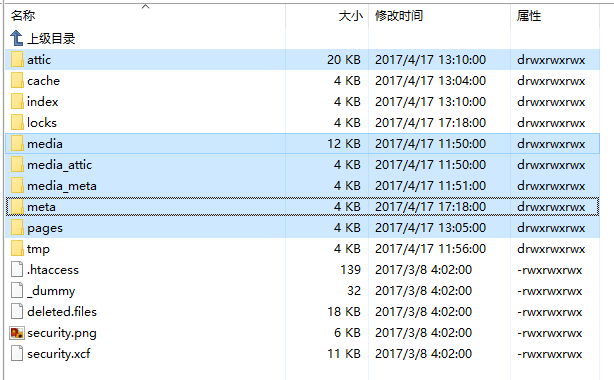
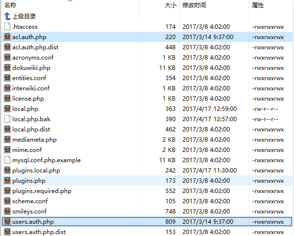

---

> 前阵子升级DokuWiki结果给升级挂了，进行任何操作都会弹出一个全屏的灰色遮照。本来已经打算不管了的，结果今天HR小姐姐来找我，说之前在DokuWiki里编辑的资料还要用，但是现在打不开。这锅是甩不掉了...尝试过修改DokuWiki的源码干掉这层遮罩，但是没搞定，只能想办法把数据搞出来重新安装一次。以下是数据备份和迁移的过程：

#### 1

备份Data目录下的attic,media,media_attic,media_meta,meta和pages文件夹，这些是DokuWiki里的数据文件。

#### 2

备份conf文件夹。其实主要是acl.auth.php和users.auth.php，这两个文件记录了用户信息和权限信息（dokuwiki是设置项，plugins是插件，这两个我没有备份）。下面这个页面解释了conf里各个配置文件的作用。

#### 3

全新安装DokuWiki，安装成功后将备份的Data文件和Conf文件覆盖到服务器上，收工。

#### 4

如果之前安装过ckgedit编辑器插件，全新安装后如果不安装此插件，页面会把样式标签（font之类的）也显示出来。

---
